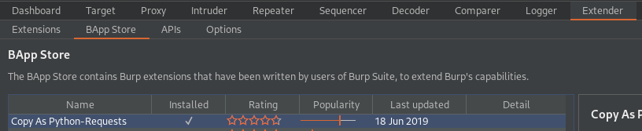
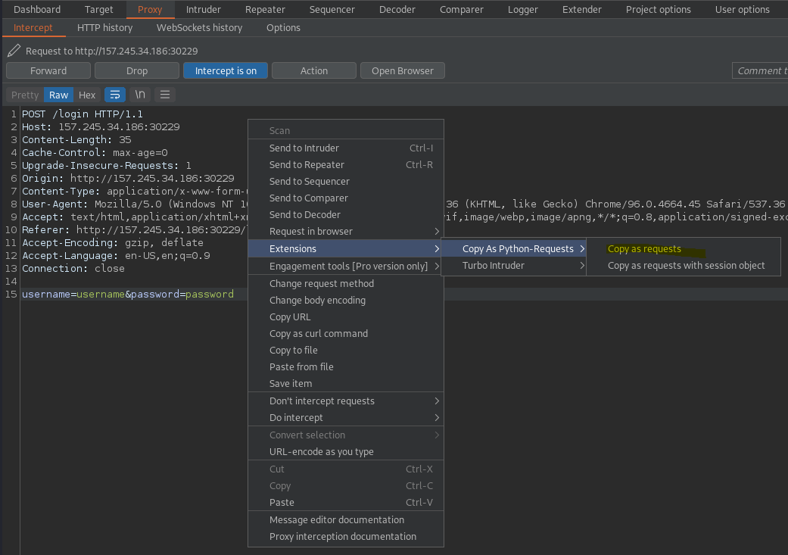
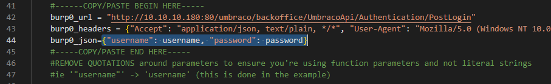
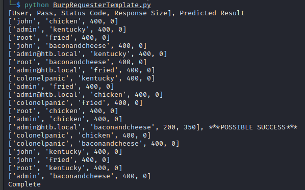

# Burp Python Intruder Template

This python template is a fast, multithreaded alternative to Burp Suite's Intruder, that I find more convenient and straightforward to use than the Turbo-Intruder extension. This template guides someone with limited Python knowledge toward implementing multi-threading for their web requests by leveraging the 'Copy As Python-Requests' extension to copy any Burp request normally sent to intruder and paste it into this template.

This template is fully documented to help you learn about multithreading in python and be able to modify/extend this template to meet your needs.

## Steps:

Install the 'Copy As Python-Requests' extension through Extender > BApp Store

Right click a request you'd normally send to intruder. Extensions > Copy As Python-Rquests > Copy as requests

Paste over the data in the indicated section of the template, removing the first (import) and last (requests.post) lines from your paste. Change request parameters from literal strings to match python function parameters.

Follow the documentation to perform slight modifications if needed.

